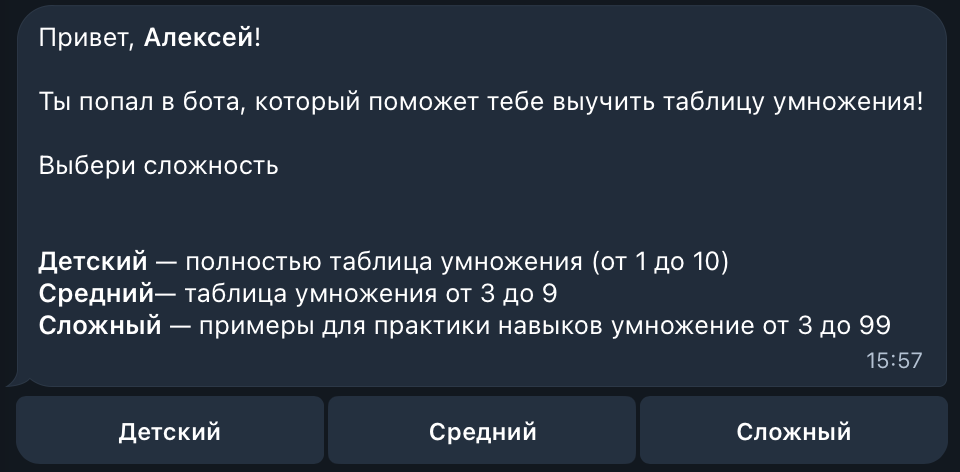
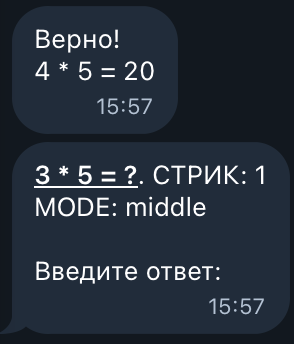
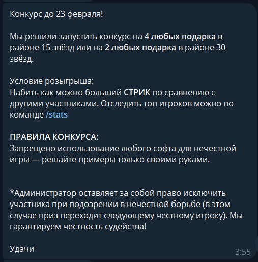
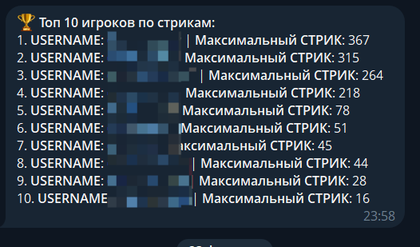
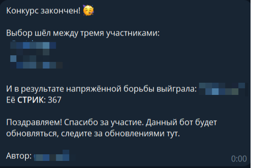
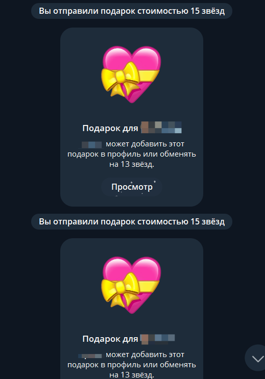
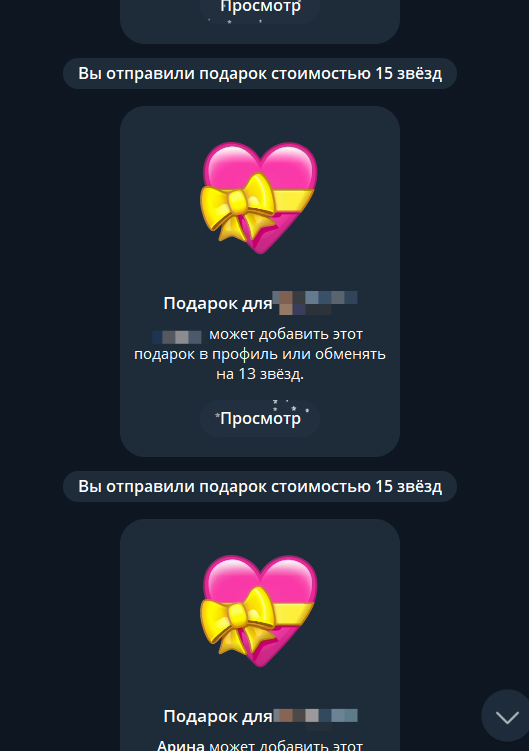
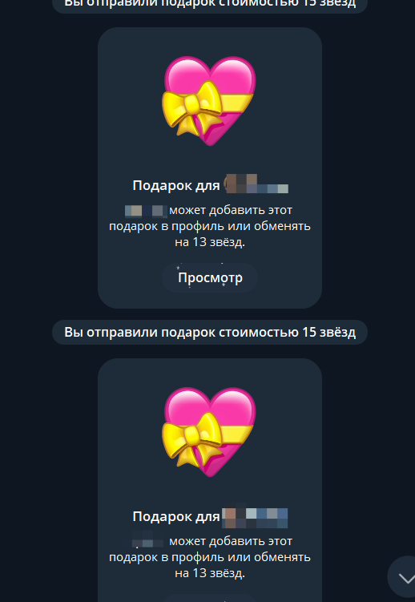
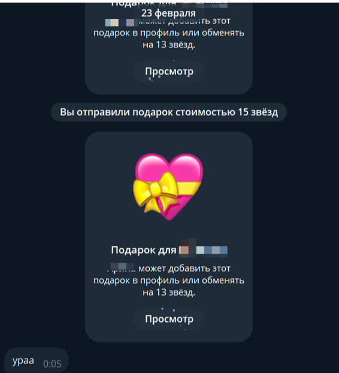

# Daily Math Buddy


> Daily Math Buddy - Telegram-бот для регулярной тренировки таблицы умножения. Он выдаёт примеры по выбранной сложности, сохраняет результат, показывает личную и глобальную статистику и помогает выработать привычку к коротким ежедневным сессиям.
> 


## Содержание

- [О проекте](#о-проекте)
- [Возможности](#возможности)
- [Скриншоты](#скриншоты)
- [Команды](#команды)
- [Установка и запуск](#установка-и-запуск)
- [Настройка](#настройка)
- [Структура проекта](#структура-проекта)
- [Лицензия](#лицензия)

## О проекте

Бот присылает новый пример сразу после решения предыдущего. Пользователь выбирает уровень сложности, а дальше бот фиксирует правильные и неправильные ответы, ведёт стрик и сохраняет статистику в БД.

Проект находится в пассивной разработке. Часть экспериментальных функций может меняться, но основной сценарий уже рабочий: старт, выбор уровня, решение примеров, статистика и режим администратора.

## Возможности

- Выбор сложности: детский, средний и сложный режим.
- Моментальная выдача следующего примера после ответа.
- Личная статистика с количеством правильных и неправильных ответов.
- Глобальный лидерборд по стрикам.
- Админ-команды для рассылки сообщений пользователям.
- Сохранение состояния пользователей и прогресса в базе данных.

## Скриншоты

### Главное меню




### Меню решения задач



### Конкурс и статистика







### Награды победителю









## Команды

### Пользовательские

- `/start` — начать работу и выбрать уровень сложности.
- `/settings` — открыть настройки уровня, часового пояса и уведомлений.
- `/stats` — посмотреть личную статистику.
- `/leader` — посмотреть глобальный рейтинг по стрикам.
- `/new_quest` — получить новый пример вручную.
- `/help` — краткая справка по боту.

### Админские

- `/send_message <сообщение>` — отправить произвольное сообщение всем пользователям.
- `/send_message` — открыть меню заготовленных сообщений из `assets/messages`.
- `/ban <user_id>` — заблокировать пользователя.

## Установка и запуск

1. Установите зависимости:

```bash
pip install -r requirements.txt
```

2. Заполните `config.py` своим токеном Telegram-бота и ID администратора.

3. Запустите бота:

```bash
python bot.py
```

Если используете Linux, можно также посмотреть `run_bot.sh` и `install_for_ubuntu.sh`.

## Настройка

В проекте используются JSON-файлы с шаблонами сообщений из `assets/messages`. Это позволяет быстро менять тексты без правки кода.

Основные настройки находятся в `config.py`:

- `TOKEN` — токен Telegram-бота.
- `ADMIN_ID` — Telegram ID администратора.

## Структура проекта

- `bot.py` — точка входа и основные хендлеры.
- `config.py` — конфигурация бота.
- `func/` — логика команд, генерация примеров и работа с БД.
- `assets/messages/` — шаблоны сообщений в JSON.
- `README/png/` — скриншоты для README.

## Лицензия

Проект распространяется под лицензией MIT. Подробности — в файле [LICENSE](LICENSE).
